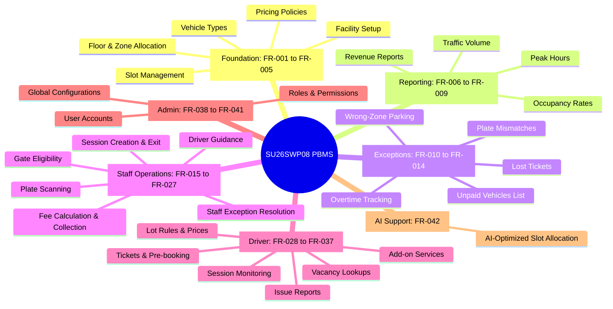
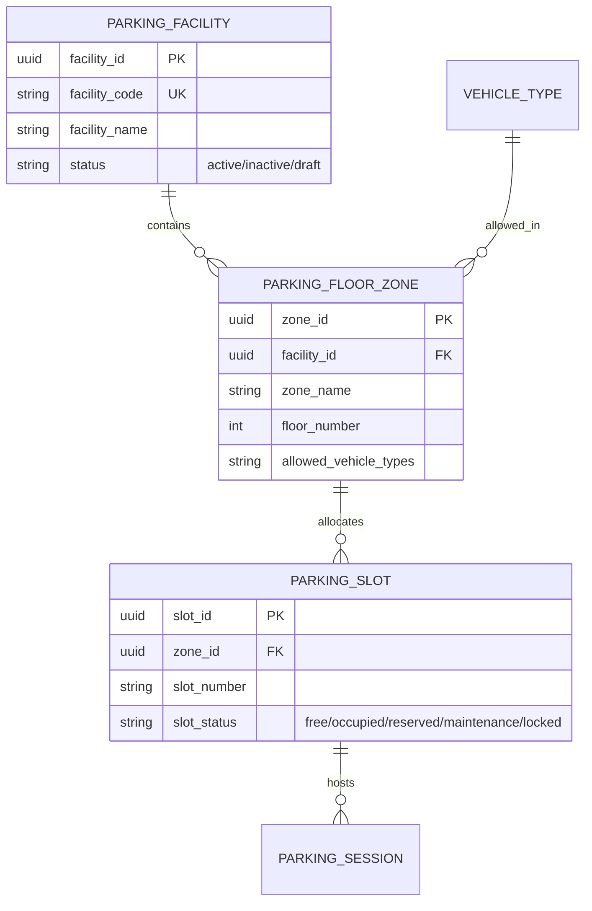

# Systems Digest & Reference Manual: Parking Building Management System (SU26SWP08)

This document serves as a centralized, high-fidelity reference manual summarizing the entire technical specifications, functional requirements, architectural guidelines, and system processes for the **Parking Building Management System**.

---

## 1. System Executive Summary

The **Parking Building Management System (SU26SWP08)** is designed to address the challenges of urban parking management, where high traffic volume and limited space require efficient, automated coordination. 

### Core Problems Addressed
- **Gate Congestion:** Eliminating bottlenecks at entry and exit points through rapid scan/registration and auto-routing.
- **Data Integrity Mismatch:** Preventing discrepancies in vehicle registration, entry/exit timestamps, and slot availability.
- **Revenue Leakage:** Closing auditing loops through strict, policy-driven fee calculations and clear transaction trails.
- **Capacity Underutilization:** Dynamically tracking occupancy and guiding drivers to optimal zones/slots.

### Project Goals & Bounds
- **Scope:** Complete configuration of facilities, zones, slot statuses, and custom pricing policies; operational entry/exit handling; exception resolution (lost tickets, mismatches, overtime); detailed reporting.
- **Limitations & Extensions:** Advanced AI slot allocation (FR-042) is highly encouraged to optimize driver search time and capacity, with a mandatory fallback to rule-based allocation.

---

## 2. Core User Roles & RBAC Matrix

The system enforces strict **Role-Based Access Control (RBAC)** to ensure data privacy and workflow integrity.

| Role | Domain Scope & Operations | Permission Level |
|---|---|---|
| **System Administrator** | Account management, role assignment, permissions, general system configuration. | **Full Admin** (Read/Write/Delete/Configure) |
| **Parking Manager** | Facility setup, vehicle class configuration, pricing/fee policy rules, report inspection, advanced exceptions auditing. | **Managerial** (Read/Write/Deactivate) |
| **Parking Staff** | Gate entry eligibility checks, license plate scanning/input, active session search, fee calculation, payment collection, exception handling (lost ticket verification, wrong-zone reassignments). | **Operational** (Read/Write on sessions, Read-only on policies) |
| **Parking User / Driver** | Read-only access to facility operational hours, vehicle compatibility lists, real-time vacant slots, session progress, fee calculation, and payment options. | **Consumer** (Read-only on public endpoints, Write-only on reservations & issue reports) |

---

## 3. Functional Domains & FR Area Mapping

The 42 Functional Requirements (FR) are organized into 7 distinct areas for governance and release planning.



### Area Details & Issue Grouping
1. **Foundation (`area:foundation`) [FR-001 to FR-005]:** 
   Configures core system infrastructure, including the facility profile, vehicle categories, physical floor/zone geometry, live slot status monitors, and dynamic pricing rules.
2. **Reporting (`area:reporting`) [FR-006 to FR-009]:** 
   Synthesizes operational logs into business intelligence dashboards detailing vehicle throughput, revenue streams, capacity utilization, and hourly peaks.
3. **Exceptions (`area:exceptions`) [FR-010 to FR-014]:** 
   Enables managers to audit anomalous events such as ticket loss, vehicle mismatches, overtime violations, and wrong-zone parking.
4. **Staff Operations (`area:staff-operations`) [FR-015 to FR-027]:**
   The operational engine used at check-in/out booths for entry validation, ticket generation, plate OCR confirmation, payment capture, and floor routing.
5. **Driver View (`area:driver`) [FR-028 to FR-037]:**
   The public interface for drivers to query operating hours, slot availability, pre-book parking slots (if enabled), monitor active session details, and report issues.
6. **Admin (`area:admin`) [FR-038 to FR-041]:**
   The system administration plane for tenant setup, security policies, RBAC provisioning, and global configuration flags.
7. **AI Support (`area:ai`) [FR-042]:**
   Advanced slot selection using heuristic/predictive models to guide drivers to optimal locations while preventing cluster congestion.

---

## 4. Technical Architecture & Component Blueprints

All functional requirements follow a standardized 4-stage architectural blueprint.

### 4.1 Relational Database Conventions
Entities utilize stable relational tables containing standard audit properties. Below is the blueprint applied to the primary operational tables:

*   **Audit Fields (Mandatory):** `created_at`, `created_by`, `updated_at`, `updated_by`.
*   **Deactivation Strategy:** Soft deletes (`status = 'inactive'` or `status = 'archived'`) are enforced on core metadata tables (`parking_facilities`, `vehicle_types`, `parking_slots`) to ensure historic transactions remain referenceable.

#### Facility & Layout Geometry Schema Concept:


### 4.2 RESTful API Design Standards
All endpoints conform to clean REST paradigms. JSON structures use camelCase keys and wrap errors inside standard envelopes.

*   **Standard Headers:**
    *   `Authorization: Bearer <JWT>`
    *   `Content-Type: application/json`
*   **Error Object Envelope:**
    ```json
    {
      "error": {
        "code": "ERROR_CODE_STRING",
        "message": "Human readable context-specific error message.",
        "details": []
      }
    }
    ```

---

## 5. Implementation Pipeline & AI Agent Skills

The development flow is governed by structured pipelines designed to automate, audit, and trace execution.

### 5.1 Pipeline Flow (Requirements to Code)
1. **init_product_vision:** Extracts business scope, goals, and limitations into `VISION_SCOPE.md`.
2. **generate_user_stories:** Converts raw feature ideas into formal user stories within `SU26SWP08-user-stories.md`.
3. **decompose_epic_to_tasks:** Generates technical checklists split by Database, Backend, Frontend, and Exceptions in `SU26SWP08-tasks.md`.
4. **calculate_priority_matrix:** Ranks requirements using Karl Wiegers' priority model to categorize stories as High, Medium, or Low priority.
5. **refine_functional_requirements:** Formalizes precise rules ("The system shall...") in `SU26SWP08-functional-requirements.md`.
6. **generate_acceptance_criteria:** Documents BDD testing scenarios in `SU26SWP08-acceptance-criteria.md`.
7. **sync_to_github_projects:** Script-driven synchronization converting specifications into GitHub issues mapped into release boards.

### 5.2 Custom Repository Management Skills
*   `setup-fr-effort-chart.md`: Extracts estimation values (`Estimate (days)`) and compiles a Mermaid visual bar chart (`doc/fr-effort-chart.md`) showing effort distribution across functional areas.
*   `setup-fr-governance.md`: Configures repository milestone timelines and applies labels targeting domain scopes (`area:foundation`, `area:reporting`, etc.).
*   `setup-fr-relationships.md`: Formulates direct parent-child relationships linking all 42 issues to a single portfolio-tracking Epic (`EPIC: FR-001..FR-042 Delivery`) via GraphQL.

---

## 6. Target Verification & BDD Acceptance Criteria

Every requirement is mapped to Behavior-Driven Development (BDD) tests utilizing the **Given - When - Then** framework.

### Example: Facility Creation (AC-001)
*   **Happy Path 1:** 
    *   **Given** a Parking Manager has valid access,
    *   **When** they create a new parking facility with valid parameters,
    *   **Then** the system stores the record and returns a `201 Created` status with the new facility payload.
*   **Edge Case 1:**
    *   **Given** a facility code already exists in the system,
    *   **When** the Parking Manager attempts to register the same code,
    *   **Then** the system rejects the transaction with `409 Conflict` and returns a `FACILITY_CODE_EXISTS` error object.

### Example: AI-Based Routing Fallback (AC-043)
*   **Edge Case:**
    *   **Given** the AI optimization engine is unavailable or timing out,
    *   **When** a driver requests slot assignment on entry,
    *   **Then** the system transparently falls back to the static floor/zone allocation rules without blocking the gate or delaying entry.

---

> [!NOTE]
> All detailed functional specification files (`FR-001-...md` through `FR-042-...md`) have been systematically mapped and validated. This digest serves as the architectural source of truth for downstream code implementation.
